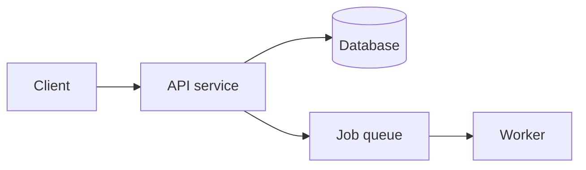

# README Best Practices

Section order and content guidance, based on the [standard-readme spec](https://github.com/RichardLitt/standard-readme), cross-checked against [banesullivan/README](https://github.com/banesullivan/README) and the [awesome-readme](https://github.com/matiassingers/awesome-readme) collection of real-world examples.

## Section order

1. **Title** — must match the repo/package name
2. **Badges** — one line, break-separated (see Badges below)
3. **Short description** — under 120 characters, answers "what is this" in one line
4. **Highlights** — 3-5 bullets, the actual selling points, not generic filler
5. **Table of contents** — include only if the draft exceeds ~100 lines
6. **Overview** — what it does, how it works, what makes it different from alternatives. 2-3 short paragraphs max.
7. **Architecture diagram** — only for genuinely multi-component projects (services, monorepos, pipelines). See Mermaid below. Skip entirely for a single-file script or a small library.
8. **Install** — copy-paste command(s) from the actual manifest, nothing invented
9. **Usage** — the smallest possible working example first, more examples after
10. **Configuration** — env vars / config file options, only if any were actually found in step 6 of the analysis checklist
11. **API reference** — for libraries: exported functions/types. Link to a separate doc if it's long; don't inline a huge API dump.
12. **Testing** — how to run the test suite, taken from the manifest's actual test script
13. **Contributing** — link to `CONTRIBUTING.md` if it exists; otherwise a short paragraph (where to file issues, PR expectations)
14. **License** — the real SPDX identifier found during analysis, with a link to the license file
15. **Credits / Related** — maintainers, related projects, acknowledgments

Not every section applies to every project — this is a menu driven by the project-type classification, not a checklist to fill unconditionally. A CLI tool's "Usage" section should show command invocations; a library's should show import + function call; a web app's should point at install → run dev server → open browser.

**Agent skill / plugin collection repos** (flagged by the signal table in `repo-analysis.md`) need a different Usage section: a per-client installation table, not generic prose. Naming a client ("works with X, Y, Z") without verifying how that client actually discovers a local skill is the same kind of unverified claim this skill exists to avoid elsewhere (manifests, license) — don't hand-wave it as "check your client's docs." Verified as of this writing:

| Client | Personal/global | Project |
|---|---|---|
| Claude Code | `~/.claude/skills/<name>/SKILL.md` | `.claude/skills/<name>/SKILL.md` |
| Codex CLI | `~/.agents/skills/<name>/SKILL.md` | `.agents/skills/<name>/SKILL.md` |
| Gemini CLI | `~/.gemini/skills/` or `~/.agents/skills/` | `.gemini/skills/` or `.agents/skills/` |
| Cursor | `~/.cursor/skills/` or `~/.agents/skills/` | `.cursor/skills/` or `.agents/skills/` |

`.agents/skills/` (and its `~/.agents/skills/` global form) is a shared convention across Codex CLI, Gemini CLI, and Cursor — one symlink there covers three clients at once. Claude Code uses its own `.claude/skills/` convention. These paths change as clients evolve — re-verify against each client's current official docs rather than trusting this table indefinitely, and if a named client's path can't be confirmed from an official source, say so explicitly instead of guessing.

## Opening statement

The first two lines carry the most weight. They must answer, in order: what is this (name + category), why is it different (the actual differentiator, not marketing fluff), who is it for. Write this last, after the analysis is done — guessing it up front produces generic filler.

## Badges

Use [shields.io](https://shields.io) badges. Only include ones backed by something real found during analysis — don't add a badge for a CI pipeline that doesn't exist.

```markdown
[](https://www.npmjs.com/package/<package>)
[](https://github.com/<owner>/<repo>/actions/workflows/<workflow>.yml)
[](LICENSE)
```

Prefer badges that stay accurate automatically (build status, license, latest version) over hardcoded numbers (star counts, download counts) that go stale the day after the README is written.

## Table of contents

Only for READMEs over ~100 lines. Link every top-level section; nest sub-sections only if the reader would actually navigate to them directly.

## Mermaid architecture diagrams

GitHub renders Mermaid natively in Markdown — no external tool needed, and it stays in sync because it lives in the same file as the code it describes. Use it when there's a real architecture to show (multiple services, a request/data flow worth visualizing), not as decoration.

````markdown

````

## GitHub-specific Markdown features

GitHub renders more than plain CommonMark. Use these where they genuinely help — not as decoration — since overusing any of them makes a README noisier, not better.

- **Alert callouts** — the standard way to flag a note/tip/warning inline, more visible than a plain bold sentence:

  ```markdown
  > [!NOTE]
  > Useful context that doesn't fit the surrounding prose.

  > [!WARNING]
  > Something that will break if ignored.
  ```

  Valid types: `NOTE`, `TIP`, `IMPORTANT`, `WARNING`, `CAUTION`. Use sparingly — one or two per README, for things that would actually cause a reader to fail (a required env var, a breaking-change caveat), not general commentary.

- **`<details><summary>` collapsible sections** — for content worth including but not worth showing by default (full CLI flag reference, a long changelog excerpt, alternative install methods):

  ```markdown
  <details>
  <summary>All CLI flags</summary>

  | Flag | Description |
  |---|---|
  | `--foo` | ... |

  </details>
  ```

- **Dark/light adaptive images** — for a logo or diagram that needs to stay legible in both GitHub themes:

  ```markdown
  <picture>
    <source media="(prefers-color-scheme: dark)" srcset="assets/logo-dark.svg">
    
  </picture>
  ```

  Only use this when a real logo/diagram asset exists in the repo — don't reference an image path you haven't verified exists.

- **Task lists** (`- [ ]` / `- [x]`) — for a roadmap or setup checklist, not for content that isn't actually a checklist.
- **Footnotes** (`text[^1]` + `[^1]: note`) — for an aside that would break the flow of a sentence if inlined.
- **"Back to top" anchors** — for a long README with a TOC, a `[↑ back to top](#readme-top)`-style link at the end of major sections helps navigation; skip it on short READMEs where it's just noise.

## Copy-paste template

```markdown
# <project-name>

[ ...]

> <one-line description, under 120 chars>

## Highlights

- <selling point 1>
- <selling point 2>
- <selling point 3>

## Overview

<2-3 short paragraphs: what it does, how, what's different>

## Install

​```sh
<real command from the manifest>
​```

## Usage

​```<language>
<smallest working example>
​```

## Configuration

| Variable | Description | Default |
|---|---|---|
| `<VAR>` | <what it does> | `<default or none>` |

## Testing

​```sh
<real test command from the manifest>
​```

## Contributing

<link to CONTRIBUTING.md, or a short paragraph>

## License

<SPDX license name>, see [LICENSE](LICENSE).
```

## Common mistakes to avoid

- Wall-of-text paragraphs with no headers/bullets/code blocks
- Missing or vague install/usage steps
- Copying an existing README's structure wholesale instead of rebuilding it from what the analysis actually found
- Full development/contributor build instructions at the top, scaring off users who just want to install the package — put those in `CONTRIBUTING.md` or near the bottom
- An architecture diagram for a project too small to need one
